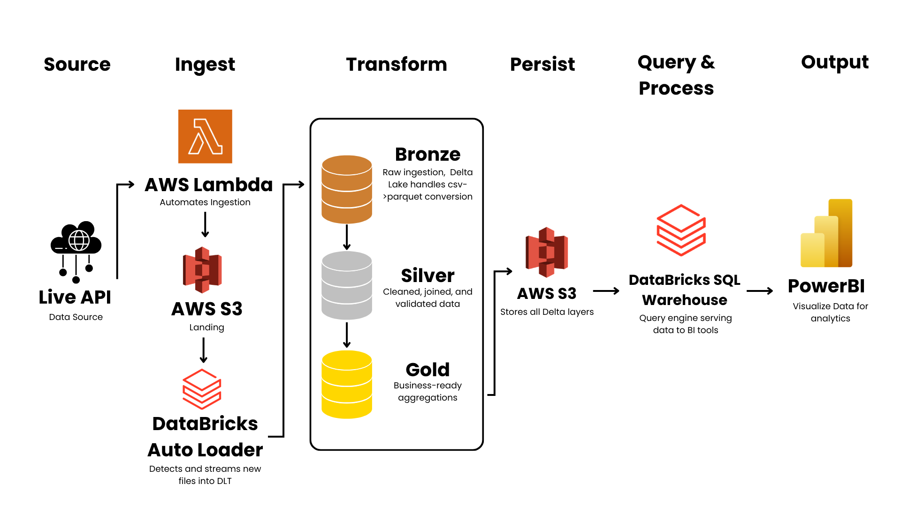
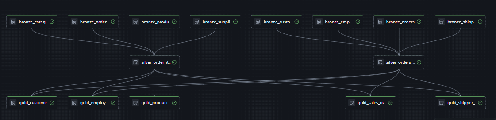
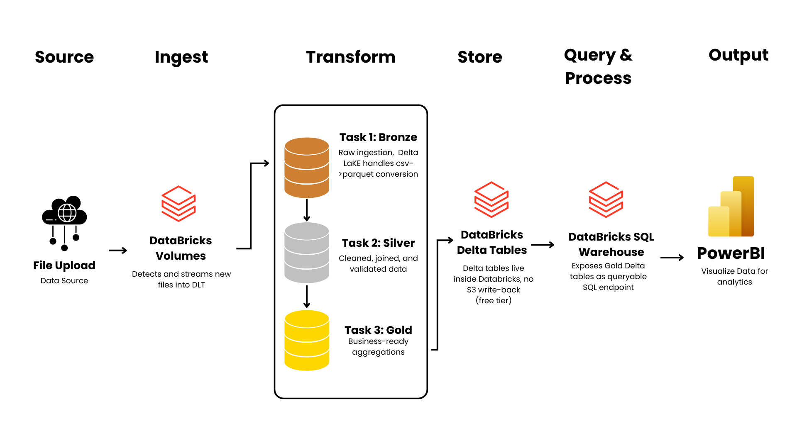

# Medallion Architecture ETL with Databricks & Power BI


I built an end-to-end data engineering pipeline using the **medallion architecture** (Bronze -> Silver -> Gold), powered by **AWS S3** and **Databricks**, with the final output visualized in a **Power BI dashboard** - covering everything from raw data ingestion all the way to a business-ready BI report.

**Live Dashboard:** [View on Power BI](https://app.powerbi.com/view?r=eyJrIjoiYjFkMThhYjktNmUxZi00ZmZlLWIzYjgtM2VmODRhYzdmNTFjIiwidCI6IjRkYTk4NTcxLWRjZWEtNDgzOS04ZmIxLTBiZGQ1ZGM5NjlmOSIsImMiOjEwfQ%3D%3D)

---

## About

I wanted to build a project that didn't just stop at data transformation. A lot of portfolio projects show ETL work in isolation, a few notebooks, some cleaned tables, and that's it. I wanted to go further: design a proper layered pipeline, make it incremental, add observability, and actually connect it to a dashboard that a business user could open and get value from.

To do that, I designed **two versions** of the same pipeline.

The first is the **production-grade architecture** - the ideal setup using Delta Live Tables (DLT), Auto Loader, and AWS S3 as the persistent data lake. This is how I would build it in a real engineering environment. I designed the architecture, wrote the DLT notebook, and documented everything end-to-end.

The second is the **free tier implementation** - the version I could actually run. Since Databricks Premium is required for Delta Live Tables and direct S3-Spark connectivity, I rebuilt the same pipeline using tools available on the free tier: Databricks Jobs & Pipelines to orchestrate three PySpark notebooks, Databricks Volumes as the landing zone, and Delta MERGE for incremental loading. This version is fully functional and runs on a daily schedule.

Both versions follow the same medallion pattern. Both produce the same Gold-layer tables. And both feed into the same Power BI dashboard - 4 pages covering sales, products, customer geography, and employee performance, connected live to Databricks via SQL Warehouse.

---

## Dataset

**Source:** [Global Online Orders - Kaggle](https://www.kaggle.com/datasets/javierspdatabase/global-online-orders/data)

8 related CSV tables forming a relational e-commerce schema:

| Table | Description |
|---|---|
| `categories` | Product categories |
| `customers` | Customer details and location |
| `employees` | Sales representatives |
| `orders` | Order headers with dates |
| `ordersdetails` | Line items per order |
| `products` | Product catalog with pricing |
| `shippers` | Shipping companies |
| `suppliers` | Product suppliers |

---

## Architecture

Both versions follow the same medallion pattern (Bronze -> Silver -> Gold) but differ in tooling due to platform constraints. The free tier version is fully implemented and functional. The production architecture is documented as the ideal end-state - the pipeline design, notebook code, and DLT declarations are all written out in full, but it could not be fully executed since Databricks Premium is required for Delta Live Tables and direct S3-Spark connectivity.

---

### Version 1: Production Architecture - S3 + Delta Live Tables (DLT)




| Layer | Node | Description |
|---|---|---|
| **Source** | Live API | Real-time data source, replaces static CSVs |
| **Ingest** | Lambda -> S3 -> Auto Loader | Lambda automates API-to-S3 drop, Auto Loader detects and streams new files into DLT |
| **Transform** | DLT: Bronze -> Silver -> Gold | Single notebook, auto dependency resolution, CSV->Parquet at Bronze, quality checks at Silver |
| **Store** | AWS S3 - persistent data lake | All Bronze/Silver/Gold Delta tables written back to S3, Databricks stays stateless |
| **Query & Process** | Databricks SQL Warehouse | Reads Gold tables from S3, exposes as SQL endpoint to Power BI |
| **Serve** | Power BI Dashboard | 4 pages, connected via SQL Warehouse, scheduled refresh |
| **Consumer/Output** | Business stakeholder | Reads Gold-layer visuals: sales, products, customers, employees |

In this version, data lands in AWS S3 and Databricks reads directly from it using **Auto Loader** (`cloudFiles`), which watches each subfolder for new files and checkpoints what has already been processed - so only new files are ingested on each run.

The entire pipeline lives in a **single DLT notebook** (`dlt_pipeline_s3.py`). Delta Live Tables automatically resolves the dependency graph between Bronze, Silver, and Gold - no need to manually chain tasks or manage execution order. Built-in `@dlt.expect` decorators enforce data quality at the Silver layer, quarantining rows that fail validation without stopping the pipeline.

All layers are written back to S3 as the persistent data lake, keeping Databricks stateless and the data portable. **If the source data arrives as CSV, it is automatically converted to Parquet format when written as a Delta table at the Bronze layer - Delta Lake stores all data as Parquet under the hood. This means S3 holds optimized, compressed, columnar data from Bronze onwards, and Silver and Gold layers never interact with the original CSV format.**

---

### Version 2: Free Tier Implementation - Databricks Jobs + Delta MERGE



| Layer | Node | Description |
|---|---|---|
| **Source** | Kaggle CSVs | Static dataset, 8 CSV tables |
| **Ingest** | AWS S3 landing -> Databricks Volumes | Manual upload to S3, then manually re-uploaded to Volumes due to S3-Spark block |
| **Transform** | Workflows: Bronze -> Silver -> Gold | Delta MERGE per task, CSV->Parquet at Bronze, cleaning/joining at Silver, aggregations at Gold |
| **Store** | Databricks-managed Delta tables | Delta tables live inside Databricks, no S3 write-back |
| **Query & Process** | Databricks SQL Warehouse | Exposes Gold Delta tables as queryable SQL endpoint |
| **Serve** | Power BI Dashboard | 4 pages, connected via SQL Warehouse, manual refresh |
| **Consumer/Output** | Business stakeholder | Reads Gold-layer visuals: sales, products, customers, employees |

Since I was on the free tier, Databricks Free Edition doesn't support direct S3 connectivity via Spark - mounting S3 buckets and reading via `spark.conf` are both blocked. So instead of DLT, I used **Databricks Jobs & Pipelines** to chain three PySpark notebooks together as sequential tasks with a single trigger.

Data is manually uploaded to **Databricks Volumes** as the landing zone, and from there the notebooks handle Bronze, Silver, and Gold transformations in order.

**Incremental loading via Delta MERGE:** Rather than reprocessing everything on every run, the pipeline uses Delta Lake's MERGE operation (upsert) at every layer. On each run, incoming rows are compared against existing Delta tables by primary key:
- Rows with a matching primary key that have changed are **updated**
- Rows with no matching primary key are **inserted** as new
- Rows that already exist and are unchanged are **skipped entirely**

This means if 7 new orders are added to the CSV, only those 7 rows are written - the existing 153 are compared but not rewritten. The pipeline also tracks row counts before and after each merge, logging a full observability report per run.

**Scheduled automation:** The pipeline runs every day at **12:00 AM** to simulatie a real business pipeline that picks up daily updates automatically which keeps compute usage minimal and run times fast.

---

## Tech Stack

| Tool | Purpose |
|---|---|
| **AWS S3** | Landing zone for raw CSV files and persistent storage for all Delta layers |
| **Databricks Free Edition** | ETL processing, Delta tables |
| **Apache Spark (PySpark)** | Distributed data transformation |
| **Delta Lake** | ACID-compliant table format across all layers; automatically stores data as Parquet |
| **Delta MERGE (upsert)** | Incremental loading - new/changed rows only |
| **Databricks Jobs & Pipelines** | Pipeline orchestration and daily scheduling |
| **Delta Live Tables (DLT)** | Production pipeline alternative (S3 version) |
| **Auto Loader (cloudFiles)** | Incremental S3 file ingestion (S3 version) |
| **Power BI Desktop** | Business intelligence dashboard |
| **Python / SQL** | ETL scripting and data transformations |

---

## Medallion Architecture

### Bronze Layer
Raw ingestion into Delta tables - no transformations, data stored exactly as received. Schema is inferred automatically via Spark, and incremental loading is handled via Delta MERGE on primary key.

**CSV to Parquet conversion:** Since the source data arrives as CSV, it is automatically converted to Parquet format when written as a Delta table. Delta Lake stores all data as Parquet under the hood - no explicit conversion step is needed. The result is optimized, compressed, columnar storage that Silver and Gold layers then read from, meaning raw CSV format never propagates beyond Bronze.

**Tables:** `bronze.categories`, `bronze.customers`, `bronze.employees`, `bronze.orders`, `bronze.ordersdetails`, `bronze.products`, `bronze.shippers`, `bronze.suppliers`

### Silver Layer
This is where the data gets cleaned, type-cast, and joined across tables. Key transformations include:
- Dropped unused columns (`Photo`, `Notes` from employees)
- Fixed inconsistent naming (`SuppliersID` -> `SupplierID`, `ContractName` -> `ContactName`)
- Cast `OrderDate` and `BirthDate` to proper date types
- Derived column: `LineRevenue = Price x Quantity`
- Joined orders with customers, employees, and shippers
- Joined order details with products, categories, and suppliers

**Tables:** `silver.orders_enriched`, `silver.order_items_enriched`

### Gold Layer
Business-ready aggregations served directly to Power BI via Databricks SQL Warehouse. These are the only tables Power BI connects to - Bronze and Silver stay internal to the pipeline.

| Table | Description |
|---|---|
| `gold.sales_overview` | Monthly revenue, orders, and items sold |
| `gold.product_performance` | Revenue and quantity by product and category |
| `gold.customer_geography` | Revenue and orders by customer and country |
| `gold.employee_performance` | Sales performance per employee |
| `gold.shipper_performance` | Revenue and orders handled per shipper |

---

## Power BI Dashboard

To close the loop on the project, I connected Power BI directly to Databricks via SQL Warehouse and built a 4-page dashboard on top of the Gold layer tables. The goal was to make the pipeline output actually usable - not just tables sitting in a database, but a report someone could open and draw insights from.

**Live Dashboard:** [View on Power BI](https://app.powerbi.com/view?r=eyJrIjoiYjFkMThhYjktNmUxZi00ZmZlLWIzYjgtM2VmODRhYzdmNTFjIiwidCI6IjRkYTk4NTcxLWRjZWEtNDgzOS04ZmIxLTBiZGQ1ZGM5NjlmOSIsImMiOjEwfQ%3D%3D)

| Page | Key Visuals |
|---|---|
| **Sales Overview** | Total revenue, orders, items sold, avg order value, revenue by month, orders by month, revenue by shipper |
| **Product & Category** | Revenue by category, top 10 products by revenue, top 10 by quantity, product table |
| **Customer Geography** | Map by country, top customers, orders by country, revenue by country, customer table |
| **Employee Performance** | Revenue by employee, orders by employee, avg revenue per order, employee table |

### Screen Previews

**Sales Overview**


**Product & Category**


**Customer Geography**


**Sales Team Performance**


---

## Pipeline Observability

Each notebook run prints a full observability report so I can see exactly what happened - how many rows were new, how many already existed, and how long each table took to process.

```
============================================================
BRONZE LAYER - PIPELINE RUN REPORT
Run completed at : YYY-MM-DD
Total duration   : s
Total new rows   : n
============================================================
Table                          Status     New Rows     Total Rows   Duration
------------------------------------------------------------
bronze.categories              merged     n            n              s
bronze.customers               merged     n            n              s
bronze.orders                  merged     n            n              s
...
============================================================
```

---

## Repository Structure

```
medallion-etl-databricks-powerbi/
├── notebooks/
│   ├── free_tier/
│   │   ├── 01_bronze.py          ← Incremental ingestion via Delta MERGE (CSV -> Parquet)
│   │   ├── 02_silver.py          ← Cleaning, joining, enrichment
│   │   └── 03_gold.py            ← Business aggregations
│   └── premium/
│       ├── dlt_pipeline.py       ← DLT version (Volumes, batch)
│       └── dlt_pipeline_s3.py    ← DLT version (S3, Auto Loader)
├── assets/
│   ├── architecture_free.png     ← Free tier architecture diagram
│   ├── architecture_s3_dlt.png   ← S3 + DLT architecture diagram
│   └── dashboard.png             ← Power BI dashboard screenshot
└── README.md
```

---

## How to Reproduce (Free Tier)

1. Download the dataset from [Kaggle](https://www.kaggle.com/datasets/javierspdatabase/global-online-orders/data)
2. Upload CSVs to AWS S3 under `s3://your-bucket/landing/{table}/{table}.csv`
3. Sign up for [Databricks Free Edition](https://www.databricks.com)
4. Go to **Catalog -> default -> default -> Create Volume** named `landing`
5. Upload all 8 CSVs into the Volume
6. Import notebooks from `notebooks/free_tier/` into your Databricks workspace
7. Go to **Jobs & Pipelines -> Create Job** named `global-orders-etl-pipeline`
8. Add 3 tasks in order: `01_bronze` -> `02_silver` -> `03_gold`
9. Set schedule to **daily at 12:00 AM**
10. Connect Power BI Desktop via **Get Data -> Databricks** using your SQL Warehouse credentials

---

## What I'd Do Next

This project gave me a solid foundation, but there are a few things I'd improve with access to the full Databricks stack:

- Use **AWS Lambda** to automate ingestion from live APIs, replacing the manual CSV upload step
- Store all layers (Bronze/Silver/Gold) back to **S3 as the persistent data lake**, keeping Databricks stateless
- Switch to **Delta Live Tables (DLT)** with Auto Loader for native streaming ingestion and built-in data quality
- Add **dbt** for Silver and Gold transformation logic for better version control and testing
- Enable **scheduled refresh** in Power BI via a paid connector for live dashboard updates
- Add **alerting** via Databricks Jobs & Pipelines email notifications on pipeline failure

---

## Author
Jen Patrick Nataba
- Built as a portfolio project for data engineering